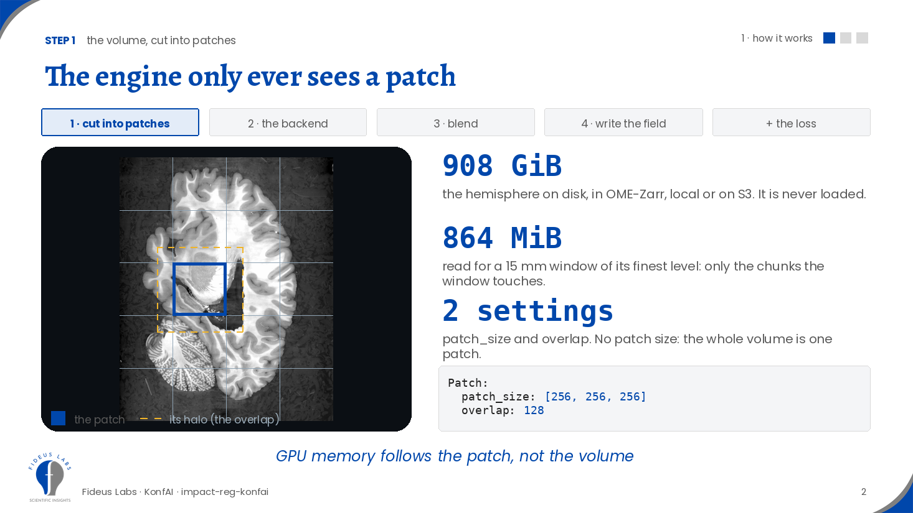
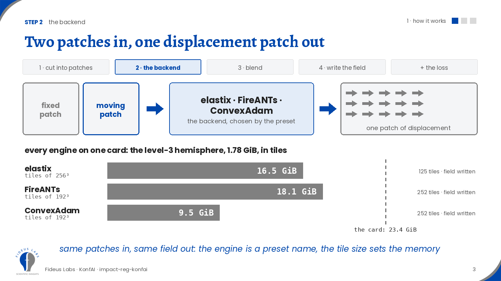
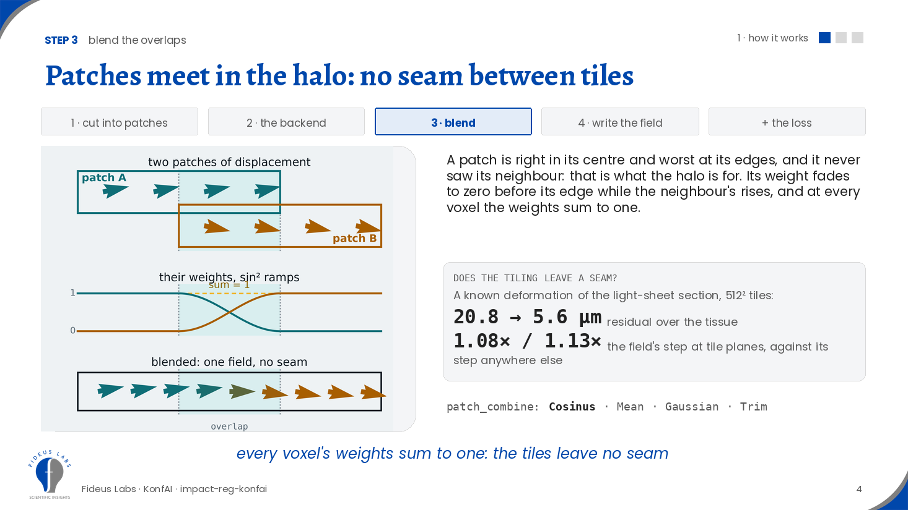
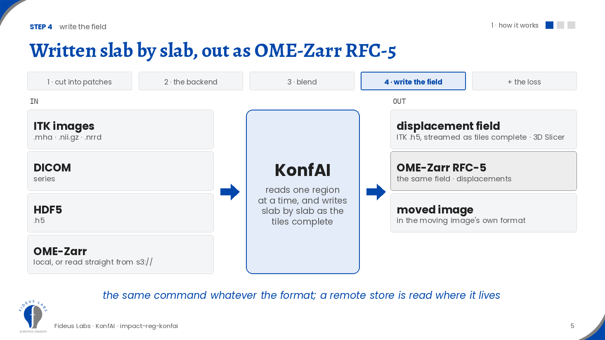
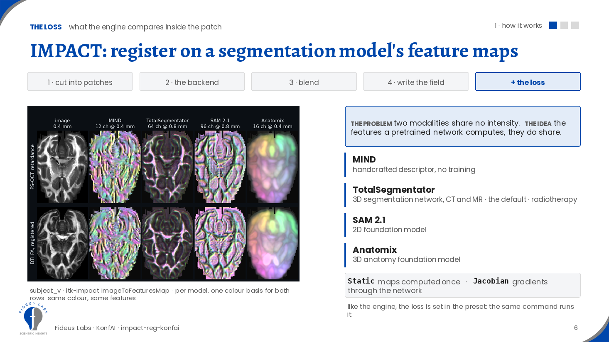
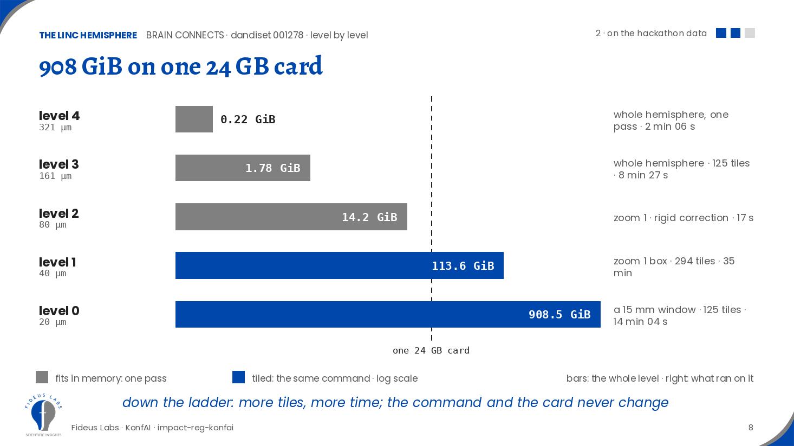
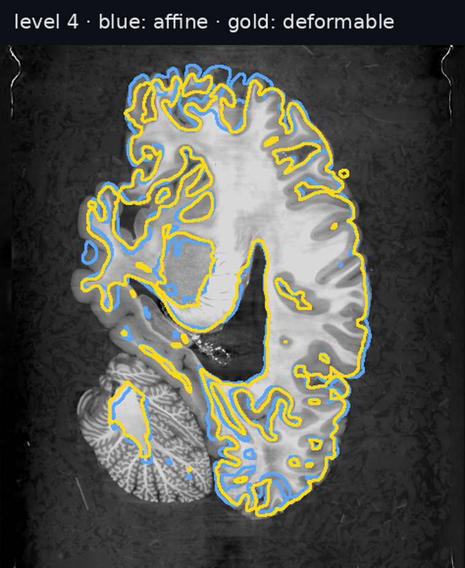
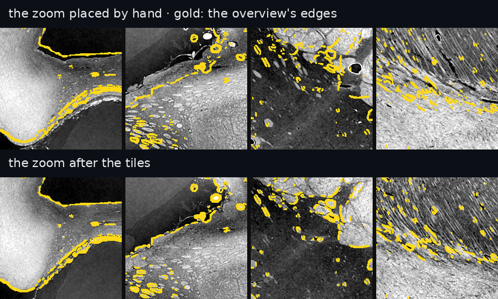
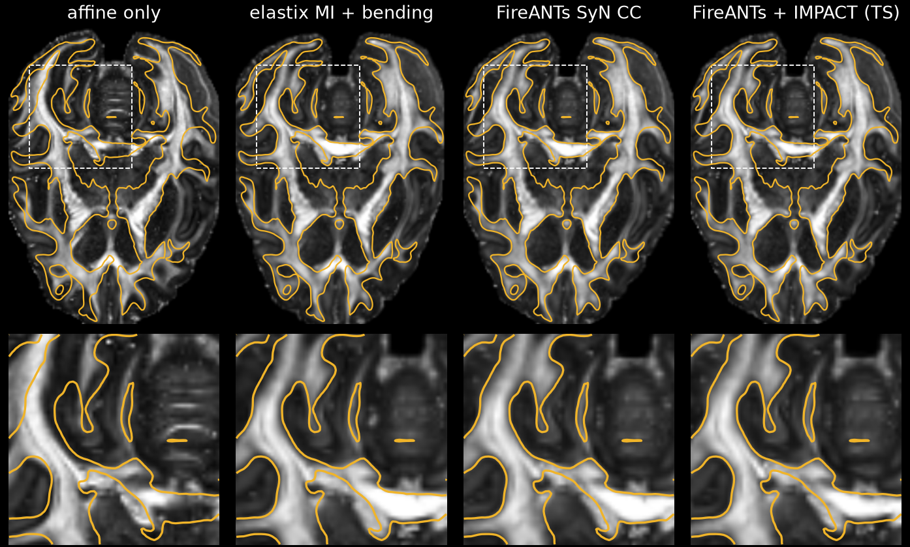

# Out-of-core multimodal registration with KonfAI and IMPACT

The registration engine only ever sees a patch. KonfAI cuts the volume into patches, gives each pair of patches to
an engine (elastix, FireANTs or ConvexAdam) with the loss of your choice, including **IMPACT**: registration on the
feature maps of a segmentation model. It then blends the patches back and writes the field. A volume that fits in
memory is the one-patch case. Shown at the APEX / BRAIN CONNECTS hackathon (UT Austin, September 2026) on a 908 GiB
synchrotron X-ray hemisphere and on the competition's DTI / PS-OCT pair.

```bash
pip install impact-reg-konfai "konfai[omezarr,monitoring,s3]" itk-impact
impact-reg-konfai register FireANTs_SyN -f Fixed.ome.zarr -m Moving.ome.zarr -o out --gpu 0
```

## How it works, in four steps

**1. The engine only ever sees a patch.** KonfAI never loads the volume. It reads one region at a time from the
OME-Zarr store (on disk or on S3): the patch and a halo around it, the overlap with its neighbours, and only the
chunks that region touches. A 15.4 mm window of the hemisphere's finest level reads 864 MiB of its 908 GiB. Two
settings, `patch_size` and `overlap`; without a patch size the whole volume is one patch.



**2. Two patches in, one displacement patch out.** Behind that contract: elastix (B-spline, Mattes mutual
information + bending energy), FireANTs (symmetric diffeomorphic SyN on the GPU) or ConvexAdam (coupled convex
optimisation refined with Adam, on MIND features). Same patches in, same field out, so the engine is a preset name.
The tile sets the memory. On the whole level-3 hemisphere (1.78 GiB), on one 24 GB card: elastix in 256³ tiles peaks at
16.5 GiB, ConvexAdam in 192³ tiles at 9.5 GiB, FireANTs in 192³ tiles at 18.1 GiB. Every tile completes and every run
writes its field ([the runs](docs/linc_demo.md#every-engine-on-the-level-3-hemisphere)).



**3. The overlaps are blended.** A patch is right in its centre and worst at its edges, and it never saw its
neighbour. Its weight fades to zero before its edge while the neighbour's rises, and at every voxel the weights sum
to one. On a known deformation of a light-sheet section in 512² tiles, the residual goes from 20.8 to 5.6 µm, and the
field's step at the tile planes is 1.08 and 1.13 times its step anywhere else: no seam.



**4. The field is written slab by slab**, as the tiles complete: an ITK displacement field (`Transform.h5`, which
3D Slicer opens). KonfAI's OME-Zarr writer stores it as OME-Zarr RFC-5, with a `displacements` transformation. The
moved image comes back in the moving image's own format. Inputs can be ITK images, DICOM, HDF5 or OME-Zarr.



**The loss.** For every engine you choose what is compared inside the patch: intensities (mutual information,
cross-correlation) or, with IMPACT, the feature maps of a pretrained network. Two modalities share no intensity; the
features a segmentation network computes, they do share. Below, a PS-OCT retardance and a registered DTI FA through
MIND (handcrafted), TotalSegmentator (a 3D segmentation network trained on CT and MR), SAM 2.1 and Anatomix. For each
model, both images share one colour basis: the same colour is the same features.



## Presets: every setting in a file

A preset is a folder: a `Prediction.yml`, and for elastix a parameter map holding the metrics, weights, grid,
iterations and samples. [`presets/`](presets/) holds the presets behind every result below; point
`KONFAI_IMPACTREG_REPO` at it.

```bash
export KONFAI_IMPACTREG_REPO=$PWD/presets

# a volume that fits: the whole hemisphere at level 4, in one pass
impact-reg-konfai register LINC_BSPLINE_L4 -f Fixed.ome.zarr -m Moving.ome.zarr \
  --fixed-mask FixedMask.ome.zarr --moving-mask MovingMask.ome.zarr -o out --gpu 0

# eight times larger: level 3, the same B-spline in 256³ tiles
impact-reg-konfai register LINC_BSPLINE_L3_TILED -f Fixed.ome.zarr -m Moving.ome.zarr \
  --fixed-mask FixedMask.ome.zarr --moving-mask MovingMask.ome.zarr -o out --gpu 0
```

The tiling is one block of the tiled preset's `Prediction.yml`:

```yaml
Predictor:
  Dataset:
    Patch:
      patch_size: [256, 256, 256]   # None: the whole volume is one patch
      overlap: 12%
  outputs_dataset:
    DisplacementField:
      OutputDataset:
        patch_combine: Cosinus      # the blend of step 3
```

A tiled run needs masks: a tile that holds only background otherwise fits the background.
[`linc/masks_linc.py`](linc/masks_linc.py) writes the tissue, widened by 1 mm.

The field is `out/P000/Transform.h5`. To store it as OME-Zarr RFC-5 and read it back:

```bash
python apex/dvf_to_rfc5.py --stream out/P000/Transform.h5 out/P000/DVF.ome.zarr
```

```python
import zarr
field = zarr.open_group("out/P000/DVF.ome.zarr", mode="r")["scale0"]["image"]   # (3, z, y, x), mm, components z, y, x
```

The LINC elastix runs were first launched as the hub preset `Generic_Rigid_BSpline` with `--set` overrides.
[`presets/make_linc_presets.py`](presets/make_linc_presets.py) writes those settings into the presets' own files,
and checks that elastix receives exactly the same parameter map.

## Run it with pixi

[pixi](https://pixi.sh) installs the whole stack (Python, PyTorch, KonfAI, impact-reg-konfai, ITKIMPACT, FireANTs,
ngff-zarr) from `pixi.toml` and runs the competition pair end to end. Put the competition's NIfTI files under
`data/input/<subject>/` (`Ret_slide_deck.nii.gz`, `dti_FA.nii.gz`, and the other slide decks alongside), then:

```bash
pixi run convert                          # every NIfTI -> data/ome-zarr/<subject>/<name>.ome.zarr, via the ngff-zarr CLI
pixi run prepare subject_v                # stage 1 (orientation, affine) and the 0.4 mm pair, as OME-Zarr stores
pixi run register FireANTs_SyN subject_v  # one preset on the pair -> out/subject_v/FireANTs_SyN/P000/
pixi run register-all                     # elastix, FireANTs and ConvexAdam on both subjects
```

Each task runs what it depends on: `register` prepares the pair, `prepare` converts the inputs. `register` takes a
preset name, a subject and the device (`--gpu 0` by default, `'--cpu 8'` for eight CPU workers);
`register-fireants`, `register-impact`, `register-convexadam` and `register-elastix` are the same with the preset
filled in. `pixi task list` shows them all. The presets come from the
[VBoussot/ImpactReg](https://huggingface.co/VBoussot/ImpactReg) Hugging Face repository on first use, and the
elastix binary from its GitHub release. A run leaves three things under `out/<subject>/<preset>/P000/`:
`Transform.ome.zarr`, the displacement field as an NGFF 0.6rc0 store with the OME-Zarr RFC-5 `displacements` transformation
(the form [docs/apex_results.md](docs/apex_results.md) describes; the register task writes it from the preset's own
`Transform.h5`, which stays beside it for 3D Slicer), and `Moved.ome.zarr`, the FA moved onto the retardance grid.

There are two environments, because the backends disagree on PyTorch: ITKIMPACT pins torch 2.12 and the elastix-IMPACT
binary is built against LibTorch 2.8. `default` runs FireANTs and ConvexAdam; `elastix` runs elastix, which
`register-elastix` selects by itself (`pixi run -e elastix register Generic_Rigid_BSpline subject_v` is the long form).
Both torches are CUDA 12 builds from the PyTorch index; the CUDA 13 build PyPI serves for torch 2.12 cannot load the
elastix binary.

The pair is built by `pipeline/prepare_pair.py` the way the competition runs were: the 48 signed axis permutations of
the FA scored by mutual information at 1.6 mm, the best three refined by an affine, the retardance resampled to 0.4 mm
as the fixed image and the FA through the affine as the moving one, with the retardance tissue widened by 1 mm as the
fixed mask. The stores are in the frame the OME-Zarr metadata gives (identity direction), so a field from here is in
that frame rather than in the `.mha` files' LPS frame of [docs/apex_results.md](docs/apex_results.md).

## On the hackathon data

**The LINC hemisphere** ([DANDI 001278](https://dandiarchive.org/dandiset/001278)): 908 GiB of synchrotron X-ray at
20 µm, and a 24 MiB diffusion-MRI map to bring into it. At level 4 the first deformable runs on the whole hemisphere
in one pass (2 min 06 s). Every level down is eight times larger and runs in tiles, on one 24 GB GPU: 125 tiles for
level 3, 294 tiles for zoom 1's box at 40 µm, and 125 tiles for a 15.4 mm window of level 0.



The MRI is scored against a reference no run sees: the consortium's own alignment of the same map. The correlation
with it goes from 0.764 after the affine to 0.888 at level 4, 0.929 after the level-3 tiles and 0.955 in the 20 µm
window. There, at the tile planes, the field changes 1.02 and 0.72 times as much as elsewhere. A 4.3 µm zoom scan,
placed on the 20 µm overview by hand, lands on the overview's edges after a rigid correction and 294 tiles. Its median
residual goes from 0.45 mm to 0.33 mm, then under 0.02 mm, within one overview voxel, in eight windows no run sees.

<p> </p>

**The competition pair**: DTI FA onto PS-OCT retardance, on the FA's 0.4 mm grid, through the same pipeline with
intensity losses or IMPACT features. Gold: the retardance's white-matter outline, the same in every panel; grey: the
FA, moving. After the affine alone the tracts sit beside the lines; after each registration, under them. The zoom is
the 24 mm box with the largest correction.



| engine and loss | preset | residual, subject_v / subject_m | tissue folded | largest displacement |
|---|---|---|---|---|
| elastix, MI + bending energy | `APEX_FA_RET_BSPLINE` | 0.40 / 0.57 mm | 0 % | 5.04 / 3.83 mm |
| FireANTs, SyN + cross-correlation | `APEX_FIREANTS_SYN_CC` | 0.40 / 0.40 mm | 0 % | 2.73 / 2.11 mm |
| FireANTs, SyN + IMPACT (TotalSegmentator features) | `APEX_FIREANTS_TS` | 0.40 / 0.57 mm | 0 % | 2.56 / 2.49 mm |
| ConvexAdam, MIND | `APEX_CONVEXADAM_MIND` | 0.57 / 0.57 mm | 1.6 % | 13.49 / 14.54 mm |

Residual: the median in-plane shift of the FA, in 12 mm windows, that best matches the retardance by mutual
information; 1.26 / 1.13 mm after the affine alone, and medians move in 0.4 mm steps. Our measures: the competition
sets no criterion. The measures by image gradients, the method settings and the file formats are in
[docs/apex_results.md](docs/apex_results.md).

## In this repository

- [`talk/`](talk/): the talk, about 7 minutes (PowerPoint, with speaker notes).
- [`presets/`](presets/): the presets behind every result, with their `Prediction.yml` and parameter maps.
- [`docs/linc_demo.md`](docs/linc_demo.md): the LINC write-up, every stage with its command, cost and checks.
- [`docs/apex_results.md`](docs/apex_results.md): the competition pair's grids, methods, measures and file formats.
- [`linc/`](linc/), [`apex/`](apex/): the scripts the results come from. They keep the absolute paths of the
  workstation they ran on, and some scripts the LINC write-up names are not included.
- [`pixi.toml`](pixi.toml), [`pipeline/`](pipeline/): the environment and the tasks that run the competition pair from
  the NIfTI files, above.

The input data and the registration outputs are not in this repository: the datasets are not ours to redistribute.
The LINC hemisphere is public on DANDI and the scripts read it from there.

Built on [KonfAI](https://github.com/fideus-labs/KonfAI), [impact-reg-konfai](https://pypi.org/project/impact-reg-konfai/),
[ITKIMPACT](https://github.com/InsightSoftwareConsortium/ITKIMPACT) and [ImpactLoss](https://github.com/vboussot/ImpactLoss).
Fideus Labs.
